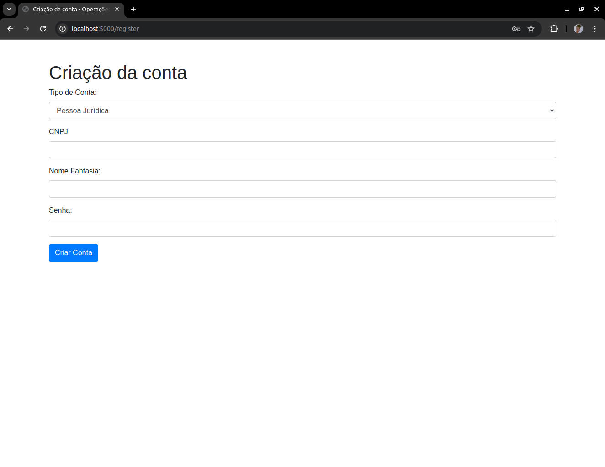
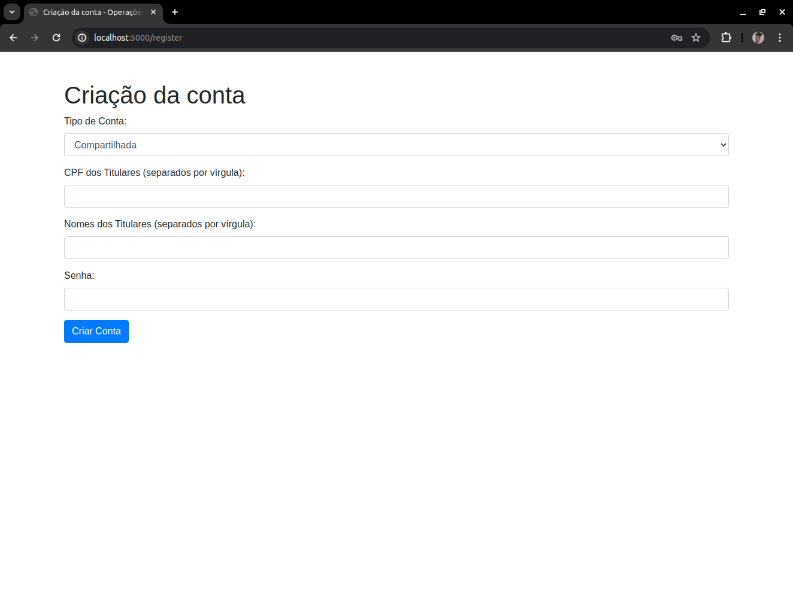
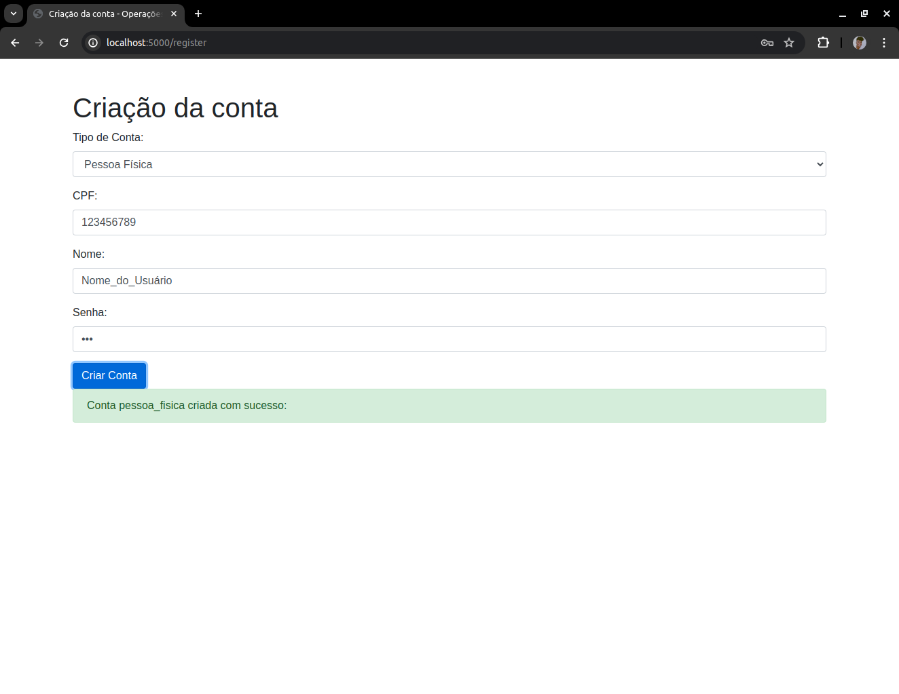
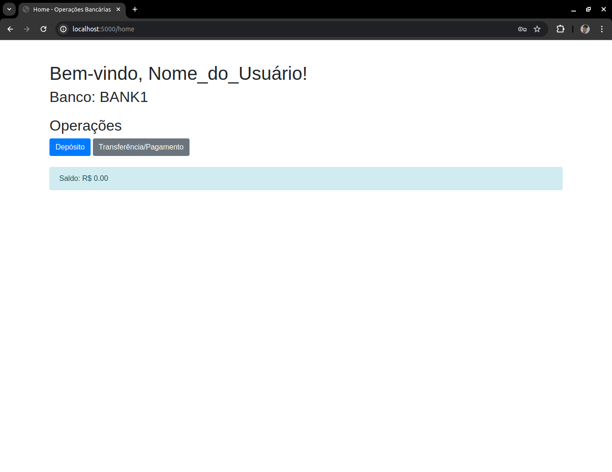
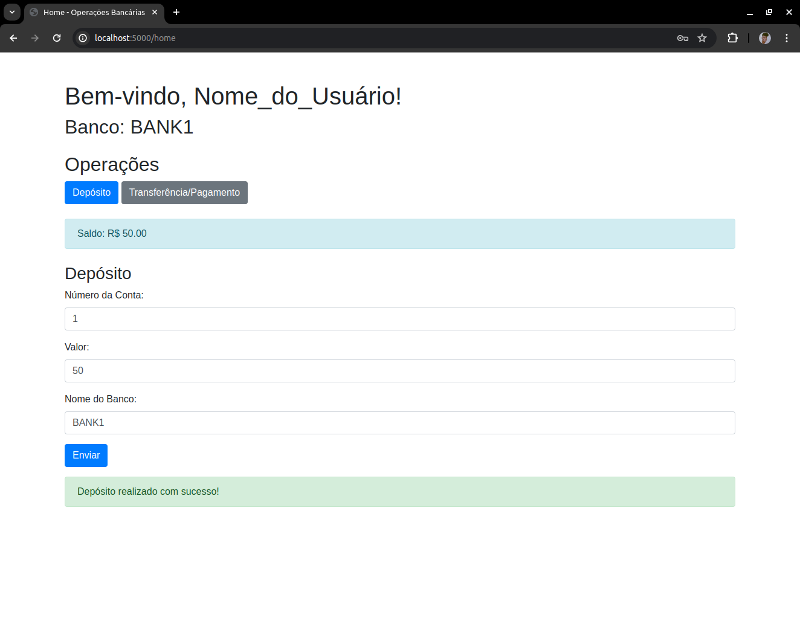
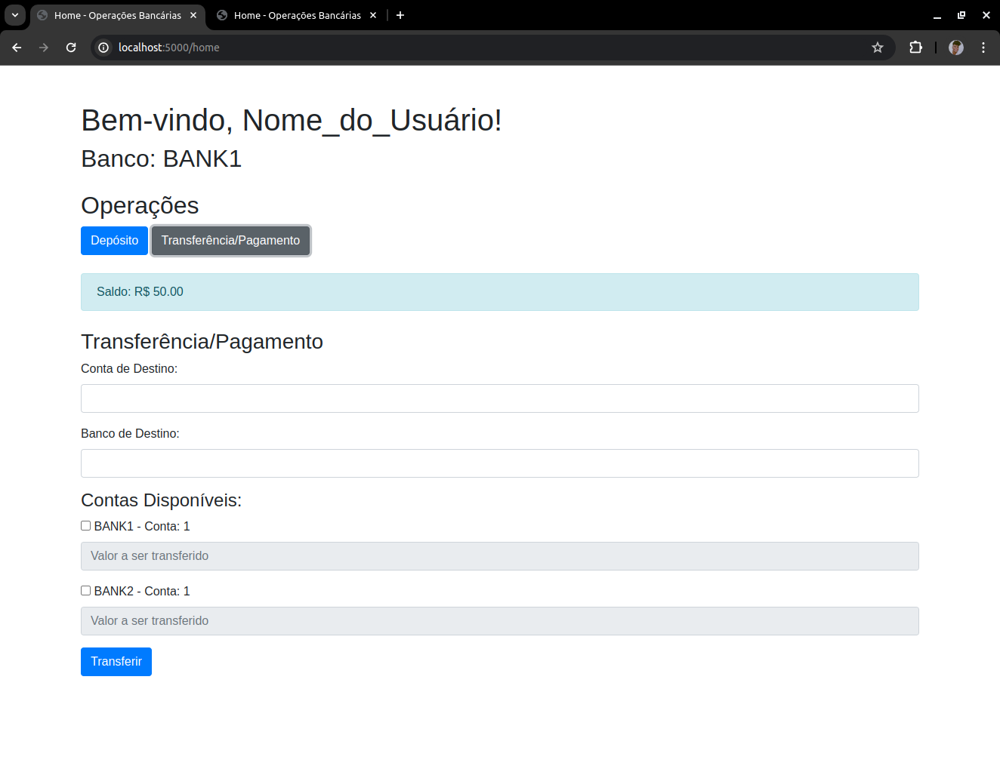
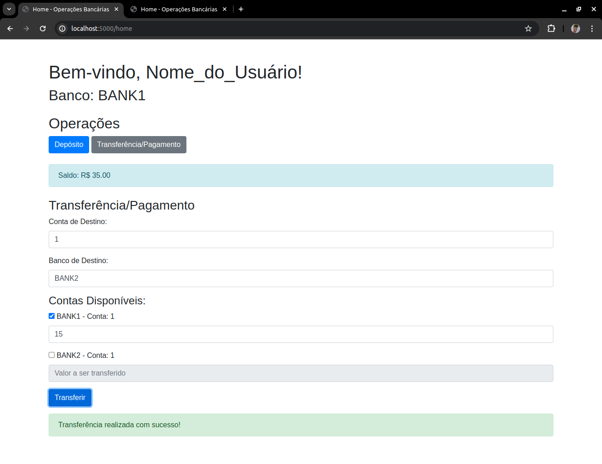
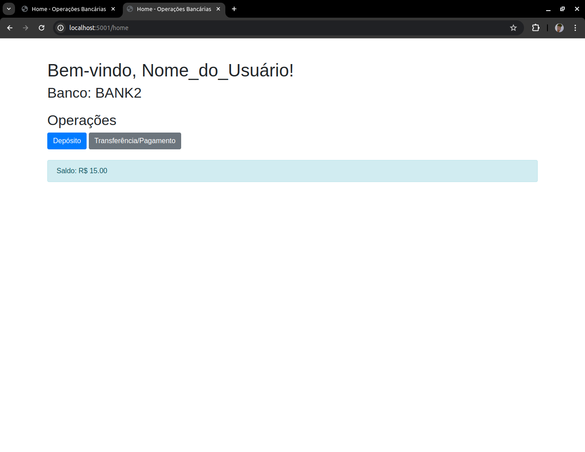

# Problema 2: Operações bancárias distribuídas

## Sumário
- [Introdução](#introdução)
- [Iniciando a Aplicação](#iniciando-a-aplicação)
- [Uso](#uso)
- [Estrutura do Projeto](#estrutura-do-projeto)
- [Construção do Projeto](#contrução-do-projeto)

## Introdução
Este projeto visa resolver o problema 2 do PBL de Concorrência e Conectividade, focando na comunicação entre três ou mais aplicações bancárias configuráveis. Ele possibilita a realização de transações em contas pertencentes ao mesmo usuário, mas em diferentes bancos, abrangendo transferências, pagamentos e depósitos, com garantia de atomicidade das operações. Além disso, o sistema suporta a criação de contas bancárias para pessoas físicas, jurídicas e contas compartilhadas.

## Iniciando a aplicação
O projeto permitir ser inicializado através do docker, a configuração atual permite instanciar três bancos. Para isso é necessário baixar a imagem do projeto no docker, através do seguinte comando:

      docker pull claudiainees/my_images:bank

Após ter baixado a imagem, pode instanciar os três em bancos em terminais distintos executando o seguinte comando:
#### Para o primeiro terminal:

      docker run -it --network=host -e FLASK_PORT=5000 -e BANK_1=0.0.0.0:5001 -e BANK_2=0.0.0.0:5002 -e BANK_NAME=BANK1 claudiainees/my_images:bank
      
Você ṕodar dar o nome que quiser ao banco na variável de ambiente "BANK_NAME". O IP e a porta das variáveos "BANK_1" e "BANK_2" devem ser alteradas caso as portas já estejam em uso, ou vá testar as aplicações em computadores distintos. 

#### Para o segundo terminal:

      docker run -it --network=host -e FLASK_PORT=5001 -e BANK_1=0.0.0.0:5000 -e BANK_2=0.0.0.0:5002 -e BANK_NAME=BANK2 claudiainees/my_images:bank

#### Para o terceiro terminal:

      docker run -it --network=host -e FLASK_PORT=5002 -e BANK_1=0.0.0.0:5000 -e BANK_2=0.0.0.0:5001 -e BANK_NAME=BANK3 claudiainees/my_images:bank

Assim, todas as aplicações dos bancos vão ser iniciadas em cada porta escolhida.

## Uso
### 1. Criação da conta
Para a criação da conta é necessário que o usuário esteja na url [http://localhost:5000/register](http://localhost:5000/register) modificando apenas o número da porta em que aplicação foi inicializada para realizar o cadastro em bancos distintos. 

  
   

      Figura 1: Criação de conta.
    

Na criação de conta de pessoa jurídica é necessário informar apenas o nome fantasia, cnpj e a senha de acesso para a conta:

  
   

      Figura 2: Criação de conta pessoa jurídica.
    

E o mesmo se aplica para criação de contas compartilhadas, sendo necessário informar os cpfs dos responsáveis por vírgula, assim como o nome dos mesmos:

  
   

      Figura 3: Criação de conta compartilhada.
    

Ao realizar o cadastro será exibida uma mensagem de sucesso, e estará pronto para fazer o login:

  
   

      Figura 4: Conta criada com sucesso.
    

### 2. Login
Após ter realizado o cadastro é possível realizar o login da conta utilizando o a url  [http://localhost:5000/login](http://localhost:5000/login). Deverá escolher o tipo de conta, o cpf/cnpj cadastrado e a senha. Caso insira as informações corretamente será direcionado para a página principal:

  
   

      Figura 5: Página incial após logado.
    

### 4. Depósito
Para realizar um depósito, deve clicar no botão de depósito na página inicial e preencher as informações da conta que você deseja depositar:

  
   

      Figura 6: Página após depósito concluído com sucesso.
    

### 5. Transferência/Pagamento
Para realizar uma transferência, deve clicar no botão de transferência na página inicial e preencher as informações da conta de destino. Caso tenha outras contas em bancos distintos ela irá aparecer nessa tela possibilitando a retirada das contas que estão em outros bancos para que realize a transação:

  
   

      Figura 7: Página de transferência.
    

Ao preencher as informações de forma correta e clicar em transferir, uma mensagem de sucesso será exibida, e o saldo terá sido removido da conta selecionada:

  
   

      Figura 8: Página de transferência realizada.
    

Na conta de destino irá aparecer o valor transferido, é necessário a atualização da tela:

  
   

      Figura 8: Página do recebimento da transferência.
    

## Estrutura do Projeto
O projeto possui a seguinte estrutura:
- Account: Na pasta [account](./account) possui as classes que definem as características de cada conta (pessoa física, jurídica ou conta compartilhada)
- Bank: Na classe [bank](./bank.py) possui todos os atributos e métodos necessários para o funcionamento do banco (como criação de contas, busca de contas, trasnferências, depósitos etc)
- Controller: No controller [endpointTest](./endpointTest.py) possui as rotas para cada funcionalidade do banco, para além de administrar qual dever ser a tela exibida. 

## Construção do projeto
#### Utilização do protocolo HTTP para comunicação entre os bancos
A comunicação entre os bancos ocorre por meio de requisições HTTP (Hypertext Transfer Protocol), seguindo o modelo cliente-servidor. Quando um banco necessita de informações de outro, ele realiza uma requisição HTTP. Nesse processo, o banco que inicia a requisição age como cliente, solicitando ao outro banco, que atua como servidor, para obter o recurso desejado. A comunicação utilizando o protocolo HTTP é suportada pelo protocolo TCP (Transmission Control Protocol), o qual assegura uma conexão confiável e orientada à transmissão de dados.
Um dos aspectos importantes para o protocolo são os métodos HTTP para conseguir indicar a ação desejada na solicitação, por exemplo, o projeto possui algumas rotas principais para atender certos tipos de requisição:
- /bank_name utilizando o método 'GET' para buscar o nome do banco.
- /login utilizando o método 'POST' para realizar o login do usuário.
- /contas utilizando o método 'POST' para criar a conta do usuário.
- /accounts/<type>/<document> utilizando o método 'GET' para buscar a conta do usuário a partir do documento.
- /accounts/bank/<bankName>/<accountNumber> utilizando o método 'GET' para buscar a conta do usuário em outros bancos a partir do número da conta. 
- /transfer utilizando o método 'POST' para tranferir um saldo.
- /receiveTransfer utilizando o método 'POST' para receber um saldo.

No projeto, predonimantemente, é utilizado os métodos GET e POST. O método GET é usado para solicitar dados de um recurso específico do servidor, podendo passar parâmetros na URL como é o exemplo para buscar a conta do usuário a partir do documento, onde é informado o tipo do documento através do type e o documento em si através do document. O método POST é usado para enviar dados para o servidor para que sejam processados, assim sendo possível passar os dados no corpo da requisição. No projeto o corpo da requisição e a resposta são sempre no formato JSON. 

#### Algoritmo Two-Phase-Commit (2PC) e uso do artifício Timestemp

A proposta do projeto é que as transações sejam realizadas de forma atômica, garantindo que ou a transação é concluída por completo ou nenhuma parte dela seja realizada. Por exemplo, é possível transferir um valor para uma conta a partir de uma ou mais contas do usuário. Se, em qualquer momento da transação, uma das contas não tiver saldo suficiente, a operação não deve prosseguir. Para alcançar esse objetivo, o projeto utiliza o algoritmo Two-Phase Commit (2PC).

##### Funcionamento do Two-Phase Commit (2PC):
##### 1. Fase de Prepare:

- Inicialmente, é feita uma requisição "prepare" para todos os bancos envolvidos na transação.
- Cada banco responde indicando se está pronto para realizar a transação e se possui saldo suficiente para reservar.
- Se algum banco não estiver pronto (seja por indisponibilidade ou por falta de saldo), é iniciado um processo de rollback em todos os bancos para desfazer qualquer operação que tenha sido preparada até então.
  
#### 2. Fase de Commit:

- Se todos os bancos responderem positivamente na fase de "prepare", é então iniciado o "commit".
- Durante o commit, todos os bancos efetivamente realizam a operação de transferência ou atualização de saldo.

O algoritmo Two-Phase Commit é utilizado para garantir a consistência e a atomicidade das transações distribuídas entre múltiplos bancos. Ele coordena o processo de decisão entre os participantes da transação (bancos, neste caso) para assegurar que, se alguma parte da transação falhar, nenhuma alteração seja permanentemente aplicada. Isso é essencial para manter a integridade dos dados e evitar inconsistências em sistemas distribuídos.

Para mitigar problemas de concorrência entre os bancos ao movimentar saldos de contas simultaneamente, foi implementado o uso de um mecanismo de timestamp. Este artifício é utilizado para garantir que apenas um banco por vez esteja autorizado a realizar operações sobre uma determinada conta. Funciona da seguinte maneira:

##### 1. Armazenamento do Timestamp:
Cada conta bancária possui uma variável que armazena o timestamp da última movimentação realizada sobre ela. Esse timestamp indica o momento exato em que a última operação foi efetuada.

##### 2. Verificação e Atualização:
- Antes de um banco iniciar qualquer operação (como uma transferência ou débito) sobre uma conta, ele primeiro verifica o timestamp atualmente registrado na conta.
- Se o timestamp atual for maior que o timestamp da última operação registrada, o banco pode proceder com a sua operação, pois isso significa que não há outra operação concorrente ocorrendo simultaneamente.
- Caso o timestamp atual seja inferior ao timestamp da última operação, isso indica que outra operação está em andamento. Nesse caso, o banco atualiza o timestamp na conta para refletir o novo tempo e tenta a operação novamente em seguida.
  
Ao utilizar esse mecanismo, cada banco assegura que apenas uma operação seja processada por vez em uma conta específica, prevenindo conflitos e inconsistências causadas por operações concorrentes.
